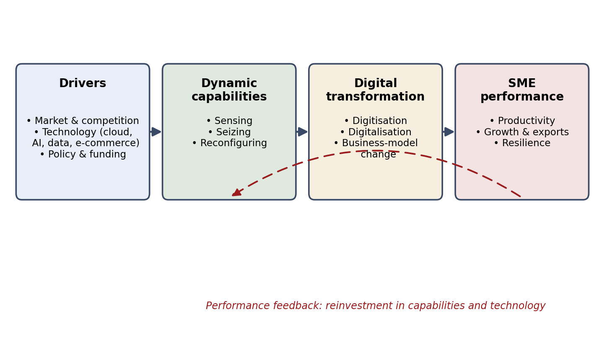
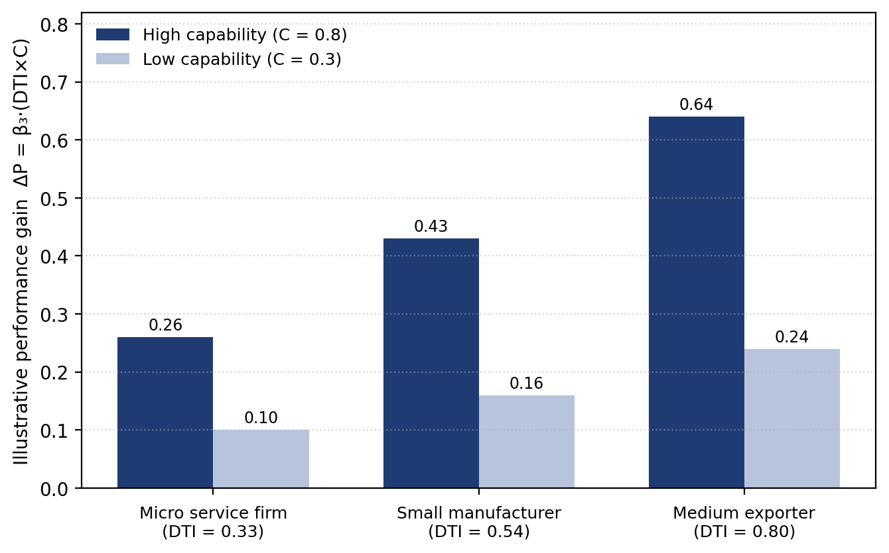

# DIGITAL TRANSFORMATION AND SME PERFORMANCE IN ASEAN AND CENTRAL ASIA: A PROPOSED MANAGEMENT FRAMEWORK

**[Author Name], [e-mail]**
**[Department]**
**[Institution]**

> Prepared for *Economic Archive / Narodnostopanski Arhiv* (Tsenov Academy, Svishtov). Revision 5. Publication-ready file: `Economic_Archive_Digital_Transformation_SMEs_Asia.docx`; a PDF preview with the figures is also provided: `Economic_Archive_Digital_Transformation_SMEs_Asia.pdf`.

**Abstract: Digital transformation is the central management challenge for small and medium-sized enterprises (SMEs), which dominate the economies of ASEAN and Central Asia yet adopt advanced digital technologies more slowly than large firms. This study proposes a management framework explaining how SMEs convert digital technologies into superior performance. Building on the dynamic-capabilities perspective and on the distinction between digitisation, digitalisation and digital transformation, the framework links external drivers to the firm’s sensing, seizing and reconfiguring capabilities, to the depth of the transformation undertaken, and to performance, with a reinvestment feedback loop. The contribution is integrative rather than metric: unlike prior reviews that establish the relevance of capabilities, and unlike existing composite indices such as the European DESI that score adoption alone, the framework embeds firm-level digital-adoption measures in an explicit capability-conditioned causal structure and states the often-asserted claim that “technology alone is not enough” as a single, estimable moderation hypothesis — a digital-transformation intensity (DTI) measure interacting with dynamic capability — together with a capability-threshold diagnostic for public support. Both constructs are operationalised with established adoption items and a validated dynamic-capabilities scale, and the data, weighting options, endogeneity concerns and estimation strategy for testing the specification are set out. The framework is built through a structured narrative review of Scopus and Web of Science sources, illustrated with a numerical example of the moderation logic, and assessed in light of secondary indicators for the ASEAN region and an expanded country vignette of Uzbekistan with a Kazakhstan comparison. The empirical estimation of the specification is identified as the principal direction for further work. The analysis points to managerial skills and finance, rather than connectivity, as the binding constraints for ASEAN and Central Asian SMEs, and derives step-by-step managerial and policy checklists accordingly.**

**Key words: digital transformation; small and medium-sized enterprises; dynamic capabilities; firm performance; ASEAN; Central Asia.**

**JEL: M15, M21, O33, L25, O10, O18, O53.**

## Introduction

Digital technologies — cloud computing, data analytics, artificial intelligence, e-commerce platforms and connected devices — have moved from being a support function to being the principal arena of competition. For enterprises of every size, the management question is no longer whether to adopt such technologies but how to convert them into durable improvements in performance. This question is most acute for small and medium-sized enterprises (SMEs). In the member states of the Association of Southeast Asian Nations (ASEAN), micro, small and medium-sized enterprises make up on average more than ninety-seven per cent of all firms and provide the large majority of employment (Asian Development Bank, 2023); in the economies of Central Asia they play a comparably central role (OECD, 2021b). Yet across both regions these firms adopt advanced digital technologies more slowly than large enterprises and face tighter constraints on finance, skills and managerial capacity (OECD, 2021a; Yoshino & Taghizadeh-Hesary, 2016).

The literature has clarified what digital transformation is, but it has paid less attention to the managerial mechanisms through which a resource-constrained SME in an emerging economy turns technology into results. Digital transformation is an organisational change process in which digital technologies reshape value creation, operations and the business model itself (Vial, 2019; Verhoef et al., 2021), and recent comprehensive reviews stress that its outcomes hinge on managerial and organisational factors rather than on technology adoption alone (Hanelt et al., 2021; Kraus et al., 2022). Whether the process raises performance depends on the capabilities the firm can mobilise around it (Teece, 2007; Warner & Wäger, 2019), and SME-focused reviews report that transformation levels in smaller firms remain low and that the field still lacks process-level guidance (de Mattos et al., 2024; Sagala & Őri, 2024). A parallel strand now links SME digital transformation to sustainability and the Sustainable Development Goals, but likewise concludes that managerial capability and a clear strategy, not technology access, determine whether transformation translates into competitive and sustainable advantage (Mick et al., 2024; Lu & Shaharudin, 2024).

This study addresses that gap with a management framework connecting the external drivers of digital transformation, the dynamic capabilities of the firm, the depth of the transformation undertaken and the resulting performance, closed by a reinvestment feedback loop. The framework is proposed and specified for testing rather than estimated here. Its contribution differs from prior work in three specific ways. First, whereas existing reviews establish that capabilities matter (Hanelt et al., 2021; Kraus et al., 2022; de Mattos et al., 2024), this study embeds firm-level digital-adoption measures in an explicit, capability-conditioned causal structure. Second, whereas composite digital-intensity indices such as the European Digital Economy and Society Index score adoption on its own, the framework states the claim that “technology alone is not enough” as a single, estimable moderation hypothesis — the interaction between digital-transformation intensity and dynamic capability — and derives from it a capability-threshold diagnostic that is new to the SME-policy debate. Third, it applies the framework to a deliberately bounded set of economies, the ASEAN region and Central Asia, with an expanded Uzbekistan vignette and a Kazakhstan comparison, where firm-level evidence is comparatively thin, rather than to “emerging Asia” as a whole.

The remainder of the article is organised as follows. Section 1 reviews the literature and defines the core constructs. Section 2 presents the framework, the measures and the estimable specification. Section 3 describes the methodology — the structured review, the data, the operationalisation of the constructs, the treatment of endogeneity and the estimation strategy. Section 4 reports a numerical illustration of the moderation logic and the regional indicators, including the expanded Uzbekistan vignette and the Kazakhstan comparison. Section 5 sets out the management and policy implications as concrete checklists. The final section concludes.

## 1. Theoretical background and literature review

Research distinguishes three increasingly profound stages of digital change. Digitisation is the conversion of analogue information into digital form; digitalisation is the use of digital technologies to improve existing processes; and digital transformation is the deeper, firm-wide change in which technology reconfigures value creation and the business model (Verhoef et al., 2021). Vial (2019) defines digital transformation as a process in which digital technologies trigger strategic responses that alter value-creation paths while the firm manages structural change and organisational barriers; large-scale reviews confirm this organisational-change reading and the centrality of strategy and leadership, noting that firms widely recognise digital technology as a strategic imperative yet struggle to execute it (Hanelt et al., 2021; Kraus et al., 2022). The implication for management is that technology alone does not deliver value; the value comes from the organisational changes that accompany it.

The dynamic-capabilities perspective explains why firms facing the same technologies achieve different results. Teece (2007) decomposes the capacity to sustain performance into sensing opportunities and threats, seizing them through investment and business-model choices, and reconfiguring (transforming) the resource base accordingly. Warner and Wäger (2019) show that digital transformation is precisely an ongoing process of strategic renewal in which these capabilities are built and rebuilt, and Kump, Engelmann, Kessler and Schweiger (2019) provide a validated survey scale that measures sensing, seizing and transforming capacities separately. Bharadwaj, El Sawy, Pavlou and Venkatraman (2013) argue that digital strategy must be fused with business strategy, and Westerman, Bonnet and McAfee (2014) add that the binding constraint is usually leadership and management capability rather than technology as such.

A further strand explains how the adoption of a specific technology is decided, and it feeds directly into the framework’s measures. The technology acceptance model relates adoption to perceived usefulness and perceived ease of use (Davis, 1989), and the unified theory of acceptance and use of technology adds performance and effort expectancy, social influence and facilitating conditions (Venkatesh, Morris, Davis & Davis, 2003); both inform the items that make up the adoption levels aggregated in the digital-transformation intensity measure below, and managerial acceptance is itself part of the sensing and seizing capability. At the organisational level, the technology–organisation–environment framework situates adoption in the interplay of technological readiness, organisational resources and the external environment (Tornatzky & Fleischer, 1990), which maps onto the framework’s capability and driver blocks respectively. For SMEs in emerging economies these models matter because the adoption decision is concentrated in a small management team and is highly sensitive to skills, cost and the surrounding digital ecosystem.

Recent empirical and policy work sharpens the picture. Teng et al. (2022), using a structural-equation model on 335 SMEs, find that digital technology, employee digital skills and a digital-transformation strategy are jointly and positively associated with transformation and, through it, with performance — evidence consistent with a capability-conditioned view and with an interaction between technology and capability. The policy-oriented literature documents the SME-specific barriers — scarce skills, limited finance and uncertainty about returns (OECD, 2021; Yoshino & Taghizadeh-Hesary, 2016) — and Nambisan, Wright and Feldman (2019) note that digital technologies also reshape innovation and entrepreneurship themselves, raising the premium on digital capability. This body of work motivates a framework in which drivers, firm-level capabilities and the depth of transformation jointly determine performance, and a specification that can be tested.

## 2. Framework, measures and estimable specification

The framework links four blocks in sequence, with a feedback loop (Figure 1). The first block is the set of external drivers: market and competitive pressure, the availability and cost of digital technologies, and the policy environment, including funding and regulation. Drivers create the incentive and the opportunity to transform, but they do not determine the outcome.

The second block is the firm’s dynamic capabilities. Following Teece (2007), an SME senses digital opportunities and threats, seizes them by investing in technology and adjusting its business model, and reconfigures its processes, skills and structure so that the technology is actually used. The third block is the depth of the transformation undertaken, from digitisation through digitalisation to business-model change (Verhoef et al., 2021). The fourth block is performance: productivity, growth and export reach, and resilience. A feedback loop closes the framework: performance gains generate resources that are reinvested in further capability building and technology, as shown by the return arrow from performance to capabilities in Figure 1.

**Figure 1. A management framework for digital transformation in SMEs**  
*Source: Authors’ elaboration based on Teece (2007), Vial (2019) and Verhoef et al. (2021). The dashed arrow denotes the performance feedback loop (reinvestment in capabilities and technology).*

### 2.1. Measuring digital-transformation intensity and capability

Two constructs must be measured. Digital-transformation intensity (DTI) summarises the digital technologies and practices a firm actually uses, as a weighted composite

> **(1)**  *DTI = Σᵢ wᵢ · aᵢ ,   Σᵢ wᵢ = 1 ,   aᵢ ∈ [0, 1] ,*

where aᵢ is the adoption level of digital element i — connectivity, a website or e-commerce channel, digital payments, cloud services, enterprise software, data analytics, artificial intelligence and digital-security measures — and wᵢ is its weight. The elements and items follow established firm-level instruments (the World Bank Enterprise Surveys and the European digital-intensity indicators) and the acceptance literature (Davis, 1989; Venkatesh et al., 2003); the measure is therefore not a new statistic but a transparent aggregation of existing ones for use inside the framework.

The weights wᵢ are not arbitrary and can be fixed by one of three transparent procedures, reported side by side as a robustness check. (i) Equal weighting sets wᵢ = 1/n for all n elements; it imposes no prior and serves only as a baseline. (ii) Expert weighting elicits the relative importance of each element from a panel of five to seven domain experts, who rate each element on a one-to-five scale, after which the normalised mean ratings become the weights; this is the recommended approach where a credible panel is available. (iii) Data-driven weighting derives the weights from the data themselves — from the factor loadings of an exploratory or confirmatory factor analysis, or from the variance shares of a principal-component analysis — so that elements carrying more common information receive more weight. Because the three procedures can diverge, the empirical strategy is to compute DTI under all three and report whether the substantive results are stable, rather than to defend a single weighting on a priori grounds.

Capability (C) is operationalised, rather than left undefined, as the firm’s dynamic capability measured on the validated scale of Kump et al. (2019), which captures sensing (S₁), seizing (S₂) and transforming (S₃) capacities through multi-item managerial-survey constructs. A composite capability index can be formed as

> **(2)**  *C = (S₁ + S₂ + S₃) / 3 ,   C ∈ [0, 1] ,*

where equal weights are a simplifying assumption adopted for exposition; empirical application should verify the factorial structure of the scale (Kump et al., 2019) rather than impose equal weights, and observable complements — managerial digital skills, the presence of an explicit digital strategy, prior technology projects and staff training — are available as proxies where survey access is limited. Because the Kump et al. (2019) scale was validated on Austrian firms, applying it to Uzbek or other Central Asian SMEs requires prior local validation — translation and back-translation, a pilot, and a confirmatory factor analysis to check that the sensing, seizing and transforming items load as intended in the new context — before the composite C is treated as comparable across settings. Subject to that validation, both DTI and C are measurable with existing, peer-validated instruments.

### 2.2. The estimable specification

Let ΔP denote the change in a performance measure (for example labour productivity, sales growth or export intensity). The framework’s central claim — that adoption pays off only when matched by capability — is a moderation hypothesis, estimated in the standard interaction form rather than asserted as a pure product:

> **(3)**  *ΔP = β₀ + β₁·DTI + β₂·C + β₃·(DTI×C) + γ·X + ε ,*

where X is a vector of controls (firm size, age, sector, region) and ε is the error term. The interaction term DTI×C is the object of interest: a positive β₃ means the marginal performance return to digital adoption, ∂ΔP/∂DTI = β₁ + β₃·C, rises with capability — the complementarity between technology and capability familiar from absorptive-capacity and complementarity theory and consistent with the structural-equation evidence of Teng et al. (2022). The additive terms β₁ and β₂ are retained precisely because theory does not require a pure product; the sign and size of all four coefficients are empirical questions to be settled by estimation, not assumptions of the model.

For the sole purpose of the numerical illustration in Section 4.1, and making no empirical claim about the additive terms, equation (3) is simplified by setting β₀ = β₁ = β₂ = 0 and β₃ = 1, which isolates and traces only the interaction effect:

> **(4)**  *ΔP = β₃·(DTI×C)   [illustration only] .*

## 3. Methodology: review protocol, data and estimation strategy

This article is conceptual with an empirical research design specified for testing; it does not itself collect primary data. The framework was developed through a structured narrative review of the literature. Searches were run in Scopus and Web of Science using the Boolean string (“digital transformation” OR “digitalisation” OR “digitization”) AND (“SME” OR “small and medium-sized enterprises”) AND (“dynamic capabilities” OR “firm performance”), restricted to peer-reviewed journal articles in English published between 2010 and 2025, and supplemented by backward and forward citation tracking of the principal reviews. Records were screened on title and abstract and retained when they addressed SMEs and linked digital transformation to capabilities or performance; foundational works on dynamic capabilities and technology acceptance were retained regardless of date because they define the constructs. The synthesis is reported as a structured narrative review: it makes the databases, search terms, time window and inclusion criteria explicit, but it does not claim the exhaustive coverage, full screening counts or PRISMA flow diagram of a systematic review, and the reading of the evidence is interpretive rather than meta-analytic.

For testing the specification in equation (3), the constructs are operationalised as follows. DTI is computed from firm-level adoption items of the kind collected in the World Bank Enterprise Surveys — whose 2024 round for Uzbekistan provides a suitable primary, firm-level data source — such as use of a website or e-commerce, e-mail with clients and suppliers, and, in recent rounds, cloud services and digital payments, complemented by the European digital-intensity indicators; the equal, expert and data-driven weighting schemes of Section 2.1 are all applied and compared. Capability C is measured with the locally validated Kump et al. (2019) sensing–seizing–transforming scale administered to owner-managers, with the observable proxies noted in Section 2.1 used where a full survey is infeasible. Performance ΔP is taken from accounts or survey self-reports (productivity, sales growth, export intensity). The baseline estimator is ordinary least squares with robust standard errors, or structural-equation modelling when the latent constructs are modelled directly; the moderation is read from the sign, size and significance of β₃ and from marginal-effect plots of ∂ΔP/∂DTI across the range of C, with the identification strategy of Section 3.1 used to support a causal interpretation.

### 3.1. Endogeneity and identification

Estimating equation (3) by ordinary least squares would not, on its own, support a causal reading, because capability and performance are plausibly jointly determined: better-performing firms generate the resources to invest in capability and technology, exactly the reinvestment loop the framework builds in, so DTI, C and the interaction term are likely correlated with the error. The design therefore treats identification explicitly. First, an instrumental-variables strategy uses instruments that shift adoption and capability but do not directly affect a given firm’s performance — the quality of local internet infrastructure (broadband speed and coverage in the firm’s district), peer adoption among neighbouring or same-sector firms, and eligibility for or distance to public digital-support programmes — estimated by two-stage least squares with the usual relevance and exclusion checks. Second, where panel data are available, firm fixed effects absorb time-invariant heterogeneity and lagged regressors reduce simultaneity. Third, the staggered roll-out of broadband and of government subsidy schemes offers quasi-experimental variation that a difference-in-differences design can exploit. These strategies are part of the proposed design; the present article specifies them rather than implementing them.

Pending such firm-level estimation, the framework is assessed in light of secondary indicators for the ASEAN region and Central Asia drawn from official and institutional sources: the Asian Development Bank (2023, 2024) and the OECD and ERIA (2024) for the ASEAN region; Yoshino and Taghizadeh-Hesary (2016) for the structural constraints on Asian SMEs; and, for the Central Asian vignettes, the OECD’s work on digital skills in Uzbekistan (OECD, 2023a) and on framework conditions for the digital transformation of businesses in Kazakhstan (OECD, 2023b), the regional outlook of OECD (2021b), World Bank country updates (2023, 2025), the World Bank Enterprise Surveys (2024) and a UNESCAP (2025) foresight initiative. Estimating β₀–β₃ on firm-level data, including a primary survey of Uzbek and ASEAN SMEs, is the principal direction for further work.

## 4. Illustration and regional indicators

### 4.1. Numerical illustration of the moderation logic

Before turning to the indicators, a numerical example clarifies what the moderation in equation (3) implies; it is a didactic device, not new empirical information, and traces only the isolated interaction of equation (4) for transparent inputs. Three representative SME profiles are used: a micro service firm with full connectivity but no analytics or artificial intelligence (DTI ≈ 0.33), a small manufacturer with moderate adoption (DTI ≈ 0.54) and a digitally advanced medium-sized exporter (DTI ≈ 0.80). Holding the slope at the illustrative value β₃ = 1, the implied performance gain is plotted for a high capability level (C = 0.8) and a low one (C = 0.3) in Figure 2, with the underlying figures in Table 1.

**Figure 2. Numerical illustration: performance gain by DTI level under high and low capability**  
*Source: Authors’ illustration of equation (4) with β₃ = 1 for didactic purposes; the values are inputs, not estimates or survey data.*

**Table 1. Numerical illustration of the DTI×capability moderation (didactic, not empirical)**

| SME profile | DTI | Gain at C = 0.8 | Gain at C = 0.3 |
|---|---|---|---|
| Micro service firm | 0.33 | 0.26 | 0.10 |
| Small manufacturer | 0.54 | 0.43 | 0.16 |
| Medium exporter | 0.80 | 0.64 | 0.24 |

*Source: Authors’ illustration of equation (4) with β₃ set to one. The values are didactic inputs, not estimates or survey data.*

The example conveys one point only: under the moderated specification, the performance return to a given level of digital adoption is far larger when capability is high than when it is low — about two-and-a-half times larger at C = 0.8 than at C = 0.3 — so a digitally advanced firm with weak capability gains little relative to its potential. This is the qualitative content of the proposition that capability, not technology, is the binding constraint; establishing its magnitude requires estimating equation (3) on firm-level data, as set out in Section 3.

### 4.2. Regional indicators for ASEAN and Central Asia

Across the ASEAN member states, micro, small and medium-sized enterprises account for the overwhelming majority of firms and the bulk of employment, and the regional digital economy is expanding rapidly (Asian Development Bank, 2023). The constraints on their digital transformation are, however, systematic. Yoshino and Taghizadeh-Hesary (2016) show that Asian SMEs are held back by limited access to finance, the absence of comprehensive databases, low research and development spending and underdeveloped sales channels — conditions that depress the capability term in the framework. The OECD and ERIA (2024) confirm that, although ASEAN governments have strengthened SME policy frameworks, the digitalisation of smaller firms remains uneven and skills and finance are recurring bottlenecks. These secondary indicators are consistent with the framework’s prediction that capability, not connectivity, is the binding constraint.

### 4.3. Country vignette: Uzbekistan

Uzbekistan illustrates both the opportunity and the constraint. SMEs are central to the economy: World Bank country updates (2025) report that micro, small and medium-sized enterprises account for over ninety per cent of businesses, about seventy-five per cent of employment and roughly fifty-five per cent of gross domestic product, and the national statistics authorities record more than 1.2 million small businesses in early 2025. Connectivity and e-commerce have grown quickly from a low base; the World Bank (2023) reports that the e-commerce market expanded roughly fivefold between 2018 and 2022, exceeding half a billion United States dollars by 2023.

National policy is organised around the Digital Uzbekistan 2030 strategy. Its principal lines of action are the build-out of digital infrastructure, the expansion of the information-technology sector and the digitalisation of public services. On the supply side, IT Park Uzbekistan, established in 2019, hosts a large and growing community of resident technology companies and anchors the strategy’s targets of substantially higher technology exports and large-scale job creation, supported by sizeable public investment in infrastructure (World Bank, 2023). On the public-services side, a unified digital-government portal and the my.gov.uz interactive services consolidate tax, statistical and licensing procedures in a single-window form intended to lower the transaction costs SMEs face. The OECD (2023a) assessment of digital skills for private-sector competitiveness in Uzbekistan documents the complementary skills agenda this requires.

The deeper transformation of enterprises nonetheless lags the roll-out of infrastructure, and the binding constraints are those the framework predicts. Coverage and quality of connectivity remain uneven between urban and rural areas; managerial and technical skills are scarce; access to finance for technology investment is limited; and the regulatory environment for the digital economy is still maturing (OECD, 2023a; World Bank, 2023). Preliminary figures presented at a UNESCAP (2025) foresight workshop suggest that only about ten per cent of SMEs were registered on the national digital public-services portal, an indication that the uptake of even basic digital government services — let alone analytics or artificial intelligence — remains shallow; this single figure is treated as indicative and would benefit from confirmation in firm-level survey data. Viewed through the lens of the framework, Uzbek SMEs increasingly possess the drivers and the connectivity but not yet the capability — skills, finance and managerial capacity — that converts adoption into performance.

A brief comparison with Kazakhstan sharpens the point. Kazakhstan launched its Digital Kazakhstan programme earlier, in 2017, and the OECD (2023b) review of framework conditions for the digital transformation of businesses there finds that, even with more mature digital infrastructure and e-government, the digitalisation of smaller firms still turns on managerial capability, skills and the regulatory and financing environment rather than on connectivity alone. The two Central Asian cases thus point in the same direction as the ASEAN evidence: infrastructure and policy ambition advance first, and the capability to convert them into firm-level performance follows more slowly. Table 2 summarises the regional, Uzbekistan and Kazakhstan indicators.

**Table 2. Digital transformation of SMEs in ASEAN and Central Asia: selected secondary indicators**

| Indicator / observation | Value | Source |
|---|---|---|
| MSME share of enterprises, ASEAN | On average > 97% of firms | ADB (2023) |
| Main SME constraints in Asia | Finance; databases; R&D; sales channels | Yoshino & Taghizadeh-Hesary (2016) |
| Uzbekistan – MSME role | > 90% of firms; ~75% jobs; ~55% of GDP | World Bank (2025) |
| Uzbekistan – e-commerce | ~5× growth 2018–2022; > USD 0.5 bn (2023) | World Bank (2023) |
| Uzbekistan – digital strategy | Digital Uzbekistan 2030; IT Park (est. 2019) | World Bank (2023); OECD (2023a) |
| Uzbekistan – SMEs on e-gov portal | ~10% registered (indicative) | UNESCAP (2025) |
| Kazakhstan – digital strategy | Digital Kazakhstan (since 2017); capability the constraint | OECD (2023b) |
| Binding constraint (framework) | Capability: skills, finance, management | This study |

*Source: Compiled by the authors from the cited institutional sources; the e-government-portal figure is indicative.*

## 5. Management and policy implications

For the management of the individual SME, the framework implies that investment should be sequenced according to capability rather than technology fashion. Because the performance return to adoption rises with capability (equation 3), a firm with weak capabilities gains more from building sensing and absorptive capacity than from acquiring advanced tools it cannot embed. The actionable corollary, which goes beyond the general advice to “invest in skills”, is a capability-matched adoption rule: a firm should advance to the next, more demanding digital element only once its capability level has risen to support it, so that DTI and C grow together along the diagonal of highest return rather than letting adoption outrun capability.

For policy in Asian emerging economies, the moderation logic yields a concrete diagnostic that is new to this debate. Because the marginal return to adoption is β₁ + β₃·C, a government can estimate the average capability level C̄ across its SME population from existing enterprise-survey data and identify the threshold beyond which subsidising further technology adoption yields less than investing the same funds in raising capability — a calculation national statistical offices could perform with the World Bank Enterprise Survey instruments already in use. Where C̄ is low, as the ASEAN and Central Asian indicators suggest, the implication is to reallocate support from hardware subsidies towards skills, advisory and diagnostic services and the SME databases and credit information that relax the finance constraint identified by Yoshino and Taghizadeh-Hesary (2016).

Shared public digital infrastructure complements both levers. Interoperable digital-payment systems, digital identity and the e-government services on which Uzbek SME uptake is only about ten per cent (UNESCAP, 2025) lower the fixed cost of transformation for the smallest firms and raise the baseline of the digital-transformation intensity index across the population (OECD & ERIA, 2024; World Bank, 2023; Asian Development Bank, 2024). Where capability building and shared infrastructure are neglected and support is confined to hardware, the predictable outcome is adoption without transformation, and the gap between dynamic and lagging firms persists.

### 5.1. How to compute the capability-threshold diagnostic

The capability-threshold diagnostic is computed in four steps. (i) Estimate equation (3) on the available SME sample to obtain β₁ and β₃. (ii) Recall that the marginal return to adoption is ∂ΔP/∂DTI = β₁ + β₃·C, so the threshold capability at which an extra unit of adoption begins to pay off (the marginal return turns positive) is C̄ = −β₁ / β₃ when β₁ < 0 and β₃ > 0. (iii) Compute the average capability of the SME population from the Kump et al. (2019) scale or its proxies and compare it with C̄. (iv) Read off the policy implication: if the population average lies below C̄, the marginal currency unit is better spent raising capability (skills, advisory services) than subsidising further hardware, and vice versa. Because C̄ depends on estimated coefficients, it should be reported with a confidence interval and re-estimated as data accumulate.

### 5.2. Checklist for SME managers

□ Compute the firm’s current digital-transformation intensity (DTI) on a 0–1 scale from the adoption items in Section 2.1.

□ Assess current capability (C) across sensing, seizing and transforming using the Kump et al. (2019) items or the observable proxies (digital skills, a written digital strategy, prior technology projects, staff training).

□ If C is low (below about 0.5): invest first in skills and training, appoint a decision-owner for digitalisation, and start with foundational tools — a business website, professional e-mail, digital payments and cloud-based accounting — before moving further.

□ If C is high (above about 0.5): advance to data analytics, integrated enterprise software and, where justified, artificial-intelligence tools, and use them to support business-model change rather than only to automate existing tasks.

□ Advance one digital element at a time, raising DTI only as C rises, so that adoption and capability grow together (the capability-matched adoption rule).

### 5.3. Checklist for policymakers

□ Estimate the average SME capability (C̄) for the country or sector from enterprise-survey data and compute the capability threshold as in Section 5.1.

□ If average capability is low (below about 0.4): channel public support towards skills, advisory and diagnostic services, SME databases and credit-information systems that relax the finance constraint (Yoshino & Taghizadeh-Hesary, 2016), rather than towards hardware subsidies.

□ If average capability is higher (above about 0.6): shift support towards infrastructure, innovation and advanced-technology adoption, where the marginal return is now greater.

□ In all cases, invest in shared digital public infrastructure — interoperable payments, digital identity and single-window e-government such as Uzbekistan’s my.gov.uz — which lowers the fixed cost of transformation for the smallest firms; and monitor SME digital uptake with firm-level surveys rather than infrastructure indicators alone.

## Conclusions

Across ASEAN and Central Asia, the firms that most need the productivity gains of digital technology — the small and medium-sized enterprises that dominate employment and output — are also those least equipped to realise them. This study argued that the decisive factor is not access to technology but the managerial capability to absorb it. Integrating the process view of digital transformation with the dynamic-capabilities perspective, it proposed a framework linking external drivers, the firm’s sensing, seizing and reconfiguring capabilities, the depth of the transformation undertaken and the resulting performance, with a reinvestment feedback loop; it operationalised both digital-transformation intensity and dynamic capability using existing, validated instruments; and it expressed the core claim as a single moderation hypothesis that can be estimated on firm-level data. Its distinct contribution is to combine an explicit capability-conditioned causal structure, an estimable interaction and a capability-threshold diagnostic, rather than to add another adoption index or another review.

Assessed in light of secondary indicators from the ASEAN region, Uzbekistan and Kazakhstan, the framework is consistent with a clear pattern: connectivity and policy ambition advance quickly, but the capability to turn technology into performance — skills, finance and management — lags behind, a pattern that also conditions whether digital transformation supports the sustainability goals now linked to it (Mick et al., 2024; Lu & Shaharudin, 2024). The practical message for managers is to grow adoption and capability together; for policymakers, to use the capability-threshold diagnostic and to fund skills, finance and shared digital infrastructure rather than hardware alone. The study’s main limitation is that the moderation is proposed and illustrated rather than estimated; the numerical example uses didactic inputs, not data. The clear next step is to estimate equation (3) on firm-level evidence — the World Bank Enterprise Surveys, including the 2024 Uzbekistan round, or a dedicated primary survey of Uzbek and ASEAN SMEs — which would quantify the interaction β₃ and the capability threshold and sharpen the policy priorities.

## References

Asian Development Bank. (2023). Asia small and medium-sized enterprise monitor 2023. Manila: Asian Development Bank. https://www.adb.org/publications/asia-sme-monitor-2023

Asian Development Bank. (2024). Digital transformation for inclusive and sustainable development in Asia. Manila: Asian Development Bank. https://www.adb.org/publications/digital-transformation-for-inclusive-and-sustainable-development-in-asia

Bharadwaj, A., El Sawy, O. A., Pavlou, P. A., & Venkatraman, N. (2013). Digital business strategy: Toward a next generation of insights. MIS Quarterly, 37(2), 471–482. https://doi.org/10.25300/MISQ/2013/37:2.3

Davis, F. D. (1989). Perceived usefulness, perceived ease of use, and user acceptance of information technology. MIS Quarterly, 13(3), 319–340. https://doi.org/10.2307/249008

de Mattos, C. S., Pellegrini, G., Hagelaar, G., & Dolfsma, W. (2024). Systematic literature review on technological transformation in SMEs: A transformation encompassing technology assimilation and business model innovation. Management Review Quarterly, 74(2), 1057–1095. https://doi.org/10.1007/s11301-023-00327-7

Hanelt, A., Bohnsack, R., Marz, D., & Antunes Marante, C. (2021). A systematic review of the literature on digital transformation: Insights and implications for strategy and organizational change. Journal of Management Studies, 58(5), 1159–1197. https://doi.org/10.1111/joms.12639

Kraus, S., Durst, S., Ferreira, J. J., Veiga, P., Kailer, N., & Weinmann, A. (2022). Digital transformation in business and management research: An overview of the current status quo. International Journal of Information Management, 63, 102466. https://doi.org/10.1016/j.ijinfomgt.2021.102466

Kump, B., Engelmann, A., Kessler, A., & Schweiger, C. (2019). Toward a dynamic capabilities scale: Measuring organizational sensing, seizing, and transforming capacities. Industrial and Corporate Change, 28(5), 1149–1172. https://doi.org/10.1093/icc/dty054

Lu, Z., & Shaharudin, M. S. (2024). Role of digital transformation for sustainable competitive advantage of SMEs: A systematic literature review. Cogent Business & Management, 11(1), 2419489. https://doi.org/10.1080/23311975.2024.2419489

Mick, A. C., Kovaleski, J. L., & Chiroli, D. M. de G. (2024). Sustainable digital transformation roadmaps for SMEs: A systematic literature review. Sustainability, 16(19), 8551. https://doi.org/10.3390/su16198551

Nambisan, S., Wright, M., & Feldman, M. (2019). The digital transformation of innovation and entrepreneurship: Progress, challenges and key themes. Research Policy, 48(8), 103773. https://doi.org/10.1016/j.respol.2019.03.018

OECD. (2021a). The digital transformation of SMEs. Paris: OECD Publishing. https://doi.org/10.1787/bdb9256a-en

OECD. (2021b). Beyond COVID-19: Prospects for economic recovery in Central Asia. Paris: OECD Publishing. https://doi.org/10.1787/03882e7b-en

OECD. (2023a). Digital skills for private sector competitiveness in Uzbekistan. Paris: OECD Publishing. https://doi.org/10.1787/6c54f447-en

OECD. (2023b). Improving framework conditions for the digital transformation of businesses in Kazakhstan. Paris: OECD Publishing. https://doi.org/10.1787/368d4d01-en

OECD, & ERIA. (2024). SME Policy Index: ASEAN 2024 – Enabling sustainable growth and digitalisation. Paris: OECD Publishing / Jakarta: Economic Research Institute for ASEAN and East Asia. https://doi.org/10.1787/f1f0c5f3-en

Sagala, G. H., & Őri, D. (2024). Toward SMEs digital transformation success: A systematic literature review. Information Systems and e-Business Management, 22(4), 667–719. https://doi.org/10.1007/s10257-024-00682-2

Teece, D. J. (2007). Explicating dynamic capabilities: The nature and microfoundations of (sustainable) enterprise performance. Strategic Management Journal, 28(13), 1319–1350. https://doi.org/10.1002/smj.640

Teng, X., Wu, Z., & Yang, F. (2022). Research on the relationship between digital transformation and performance of SMEs. Sustainability, 14(10), 6012. https://doi.org/10.3390/su14106012

Tornatzky, L. G., & Fleischer, M. (1990). The processes of technological innovation. Lexington, MA: Lexington Books.

UNESCAP. (2025). Uzbekistan foresight on digital public services for small and medium-sized enterprises [Foresight workshop]. Bangkok: United Nations Economic and Social Commission for Asia and the Pacific. https://www.unescap.org/events/2025/uzbekistan-foresight-digital-public-services-small-and-medium-sized-enterprises

Venkatesh, V., Morris, M. G., Davis, G. B., & Davis, F. D. (2003). User acceptance of information technology: Toward a unified view. MIS Quarterly, 27(3), 425–478. https://doi.org/10.2307/30036540

Verhoef, P. C., Broekhuizen, T., Bart, Y., Bhattacharya, A., Qi Dong, J., Fabian, N., & Haenlein, M. (2021). Digital transformation: A multidisciplinary reflection and research agenda. Journal of Business Research, 122, 889–901. https://doi.org/10.1016/j.jbusres.2019.09.022

Vial, G. (2019). Understanding digital transformation: A review and a research agenda. The Journal of Strategic Information Systems, 28(2), 118–144. https://doi.org/10.1016/j.jsis.2019.01.003

Warner, K. S. R., & Wäger, M. (2019). Building dynamic capabilities for digital transformation: An ongoing process of strategic renewal. Long Range Planning, 52(3), 326–349. https://doi.org/10.1016/j.lrp.2018.12.001

Westerman, G., Bonnet, D., & McAfee, A. (2014). Leading digital: Turning technology into business transformation. Boston, MA: Harvard Business Review Press.

World Bank. (2023). Supporting Uzbekistan in developing the digital economy and creating new jobs in the information technology sector [Country update]. Washington, DC: World Bank. https://www.worldbank.org/en/news/press-release/2023/11/30/world-bank-to-support-uzbekistan-in-developing-the-digital-economy-and-creating-new-jobs-in-the-it-sector

World Bank. (2024). World Bank Enterprise Survey 2024: Uzbekistan (UZB_2024_WBES) [Data set]. Washington, DC: World Bank Group. https://microdata.worldbank.org/index.php/catalog/6711

World Bank. (2025). Improved access to finance to help businesses in Uzbekistan grow and create jobs [Country update]. Washington, DC: World Bank. https://www.worldbank.org/en/news/press-release/2025/12/15/improved-access-to-finance-to-help-7000-businesses-in-uzbekistan-grow-and-create-jobs

Yoshino, N., & Taghizadeh-Hesary, F. (2016). Major challenges facing small and medium-sized enterprises in Asia and solutions for mitigating them (ADBI Working Paper No. 564). Tokyo: Asian Development Bank Institute. https://www.adb.org/publications/major-challenges-facing-small-and-medium-sized-enterprises-asia-and-solutions
