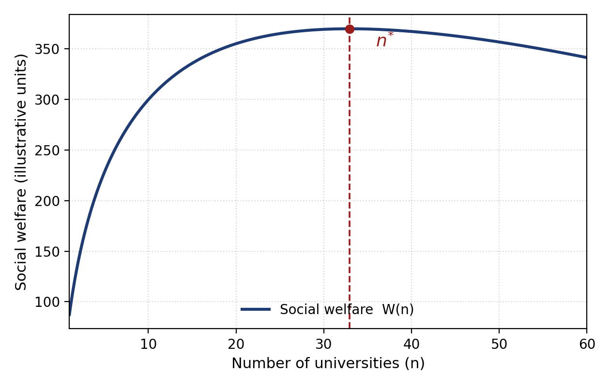

# QUALITY–MARGIN COMPLEMENTARITY IN HIGHER EDUCATION: COMPETITION, SERVICE QUALITY AND THE OPTIMAL NUMBER OF UNIVERSITIES

**[Author Name], [e-mail]**
**[Department]**
**[Institution]**

> Prepared for submission to *Economic Archive / Narodnostopanski Arhiv* (D. A. Tsenov Academy of Economics, Svishtov). Formatted per the journal template (Times New Roman 14 pt; APA references). The publication-ready file is `Economic_Archive_Quality_Margin_Higher_Education.docx`.

**Abstract:** This study reframes the economics of higher education as a problem of institutional and system management rather than of firm-like profit seeking. It develops a stylised model in which the academic quality of a higher education institution and its operating margin are complementary: a mission-centred institution that is also margin conscious reinvests its surplus into the inputs of perceived service quality, while higher quality raises willingness to pay and public support and thus the margin that can be sustained. The resulting positive feedback is shown to be supermodular and helps explain the hierarchical structure of higher education systems. The model is then extended to the system level to characterise the optimal number of universities, which balances economies of scale and quality dilution against the benefits of competition, programme variety and access, net of duplicated fixed costs. The analysis yields an interior optimum and a set of managerial and policy implications for resource allocation, quality assurance, performance-based funding and the consolidation of fragmented systems, illustrated with reference to the Bulgarian higher education sector.

**Key words:** higher education management; service quality; competition; optimal number of universities; financial sustainability.

**JEL:** I21, I23, I28, L13, H52.

## Introduction

Higher education systems across Europe operate under a paradox that has become central to their management. Institutions are expected to raise the quality of the educational service they deliver while, at the same time, remaining financially viable under tightening public budgets and growing competition for students, staff and reputation. These two objectives are frequently presented as a trade-off: spending more on quality erodes the surplus, while protecting the surplus constrains quality. The present article argues that, for a mission-driven institution, the relationship is better understood as one of complementarity. Quality and the operating margin reinforce one another through a managed process of reinvestment, and the central management task is to sustain this virtuous cycle rather than to trade one objective off against the other.

This perspective is deliberately managerial. Following Massy (2016), a well-run institution is simultaneously mission centred, market smart and margin conscious: the margin is not an end in itself but the financial means through which the academic mission and the quality of the service are secured over time. Reading the surplus as a managerial instrument, rather than as profit, distinguishes the analysis of higher education from the analysis of commercial firms and locates it squarely within the economics of a mission-oriented sector (Winston, 1999; Rothschild & White, 1995).

The article pursues two questions. First, at the level of the individual institution, under what conditions are academic quality and the operating margin complementary, and what does this imply for resource and quality management? Second, at the level of the system, how many universities should a country such as Bulgaria sustain, given that the number of providers shapes both the resources available per institution and the intensity of competition? The two questions are connected: the managed complementarity between quality and margin at the institutional level is precisely what makes the number and configuration of institutions a decision variable for system governance.

The contribution is threefold. The study (i) formalises the quality–margin complementarity as a supermodular relationship and links it to the well-documented hierarchy of higher education systems; (ii) derives an interior optimal number of universities from a social welfare function that trades scale economies and quality against competition, variety and access; and (iii) translates both results into concrete management and policy recommendations, illustrated with the Bulgarian sector. The remainder of the article is organised as follows. Section 1 reviews the relevant literature. Section 2 presents the institutional model of quality–margin complementarity. Section 3 develops the system-level model of the optimal number of universities. Section 4 discusses the management and policy implications. The final section concludes.

## 1. Theoretical background and literature review

The economics of higher education has long emphasised that universities are not ordinary firms. Winston (1999) shows that prices cover only a fraction of production costs, that students are subsidised in strikingly unequal amounts, and that students are simultaneously customers and inputs into the production of educational quality through peer effects. Rothschild and White (1995) formalise the same insight: in services where the customers are inputs, efficient pricing must internalise the effect that students exert on one another, so that the market for higher education departs systematically from the textbook competitive model. These contributions establish the analytical foundation for treating the surplus, or margin, as a managerial resource rather than as a measure of profitability.

A second strand concerns competition and market structure. De Fraja and Iossa (2002) show that when students are mobile and institutions compete for them, an asymmetric equilibrium emerges in which one institution attracts the ablest students and charges the highest fees, giving rise to an elite institution. Hoxby (2009) documents empirically how the integration of the United States market for undergraduate education increased competition, drove selective institutions to raise quality, tuition and spending, and produced sharper differentiation across providers. Marginson (2006) interprets these dynamics as a positional market in which reputation is the scarce good. The common thread is that competition in higher education does not equalise providers; it stratifies them, with direct consequences for how many institutions a system can viably support.

A third strand examines markets, marketisation and management. Jongbloed (2003) sets out the conditions under which genuine markets can operate in higher education and the regulatory ingredients that public authorities must supply. Teixeira, Jongbloed, Dill and Amaral (2004) assess how far market mechanisms in the sector are rhetoric and how far they are reality. Massy (2016) brings the discussion into the management domain, arguing that institutions can improve efficiency and contain costs while preserving academic values, provided they obtain reliable data on the cost and quality of teaching and manage the margin deliberately. This managerial reading is the one adopted here.

A fourth strand concerns the measurement of educational quality as a service. Parasuraman, Zeithaml and Berry (1988) introduced SERVQUAL, the multi-item instrument that conceptualises service quality as the gap between expectations and perceptions across dimensions such as reliability, responsiveness and assurance. Abdullah (2006) adapted this tradition to higher education with the HEdPERF scale, which captures sector-specific determinants of perceived quality, including academic and non-academic aspects, reputation, access and programme issues. These instruments matter for management because they make the otherwise intangible output of a university observable and therefore manageable, and because perceived quality is the channel through which reinvestment translates into demand and willingness to pay.

Finally, quality is increasingly mediated by rankings and league tables. Dill and Soo (2005) compare national ranking systems and show how they shape the definition of quality that institutions pursue, while Hazelkorn (2015) documents how rankings reshape institutional strategy and national policy in the global competition for world-class status. For system governance, the efficiency of public spending is the corresponding concern: the European Commission (2010) analyses the efficiency and effectiveness of tertiary-education expenditure across the European Union, and Tochkov, Nenovsky and Tochkov (2012) estimate the relative efficiency of Bulgarian universities, finding that a larger share of the education market and a more focused field portfolio are associated with efficiency gains. Taken together, the literature motivates a model in which quality and margin are jointly managed at the institutional level and in which the number of providers is a lever of system efficiency.

## 2. A model of quality–margin complementarity at the institutional level

Consider a mission-centred higher education institution that enrols *S* students and chooses a level of academic and service quality *Q*. Quality is the composite construct measured by instruments such as SERVQUAL and HEdPERF (Parasuraman et al., 1988; Abdullah, 2006); it is produced by inputs — faculty, support services, facilities, libraries and student support — whose cost per student, *c(Q)*, is increasing and convex, *c′(Q) > 0* and *c″(Q) > 0*. Revenue per student, *p(Q)*, combines tuition and public subsidy and is increasing in quality, *p′(Q) > 0*, because higher perceived quality raises both willingness to pay and the public support that performance-based funding directs to better institutions. The operating margin per student is the difference between revenue and cost:

$$ m(Q) = p(Q) - c(Q) \qquad (1) $$

A mission-centred institution does not maximise *m*. Instead, it reinvests a share *ρ ∈ (0, 1]* of the margin it generates into the quality-producing inputs of the next period, retaining the remainder as a financial reserve that protects the mission against shocks. With a baseline endowment of resources *B* (public block grants, endowment income), the quality that the institution can sustain is

$$ Q = \theta \cdot \frac{\rho \, m(Q)\, S + B}{S} = \theta\,(\rho\, m(Q) + B/S) \qquad (2) $$

where *θ > 0* is the efficiency with which resources are converted into perceived quality — the managerial productivity parameter that good resource management raises (Massy, 2016; Tochkov et al., 2012). Equations (1) and (2) form a fixed-point system: quality depends on the reinvested margin, and the margin depends on quality. A stable interior solution *Q\** exists when the marginal revenue of quality exceeds its marginal cost at low quality but the convexity of *c(Q)* eventually reverses the inequality.

The central managerial property is complementarity. Define the institution's objective as a mission value function *V(Q, m)* that rewards both the quality delivered to students and the financial resilience secured by the margin, with the two arguments interacting through the reinvestment technology in equation (2). Quality and margin are complements when the mixed second derivative is positive,

$$ \frac{\partial^2 V}{\partial Q \, \partial m} > 0 \qquad (3) $$

that is, when a higher margin raises the marginal mission value of quality and, symmetrically, when higher quality raises the marginal mission value of an additional unit of margin. Under condition (3) the value function is supermodular, and the optimal managerial response to a favourable shock — a grant, a successful programme, an efficiency gain that lifts *θ* — is to raise quality and margin together rather than to substitute one for the other. This is the formal sense in which "margin conscious" and "mission centred" management coincide rather than conflict (Massy, 2016).

The complementarity also has a system-level consequence. Because *p′(Q) > 0* operates partly through relative standing in a positional market (Marginson, 2006; Hazelkorn, 2015), institutions that begin with a higher endowment *B* or a higher conversion efficiency *θ* sustain a higher margin, reinvest more, and pull further ahead in quality. The same feedback that stabilises a single institution therefore generates a hierarchy across institutions, reproducing the stratification described by Winston (1999), Hoxby (2009) and De Fraja and Iossa (2002).

**Table 1. Channels of the quality–margin complementarity and their managerial levers**

| Channel | Mechanism | Managerial lever |
|---|---|---|
| Reinvestment | A share ρ of the margin funds quality inputs (eq. 2) | Surplus-allocation policy; multi-year reserves |
| Willingness to pay | Higher perceived quality raises p(Q) via demand | Service-quality management (SERVQUAL/HEdPERF) |
| Public support | Performance funding rewards measured quality | Quality assurance; data on teaching cost and outcomes |
| Conversion efficiency | θ turns resources into quality more cheaply | Process re-engineering; programme focus |
| Positional standing | Relative quality drives reputation and selectivity | Strategic positioning; niche differentiation |

*Source: Authors' elaboration based on Winston (1999), Massy (2016) and Parasuraman et al. (1988).*

## 3. Competition, service quality and the optimal number of universities

The institutional model takes the endowment per student *B/S* as given. At the level of the system, however, both resources per institution and the intensity of competition depend on how the fixed pool of students and public funds is divided among providers. Let a country have a fixed number of students *N* and let *n* identical universities each enrol *S = N/n*. Two opposing forces operate on welfare as *n* changes.

On one side, concentration raises quality. Each institution bears a fixed cost *F* — senior management, accreditation, libraries, laboratories, digital infrastructure — that does not scale with enrolment. With *n* institutions, the duplicated fixed cost per student is *nF/N*, which rises with *n* and reduces the resources available for the quality-producing inputs of equation (2). Spreading a given student body and budget over more institutions therefore dilutes quality: *Q(n)* is decreasing in *n*. This is the scale-economy argument for fewer, larger universities, consistent with the efficiency evidence that a larger market share and a focused field portfolio raise university efficiency (Tochkov et al., 2012).

On the other side, more institutions increase welfare through three channels. Competition disciplines costs and stimulates quality improvement, as documented for integrated markets by Hoxby (2009) and analysed by De Fraja and Iossa (2002). Variety allows the system to match a heterogeneous student population to differentiated programmes and missions (Jongbloed, 2003; Teixeira et al., 2004). Access improves when institutions are distributed across regions, lowering the geographic and social cost of participation. Let *g(n)* capture the combined competition, variety and access benefit, with *g′(n) > 0* and *g″(n) < 0*.

Writing *v(·)* for the social value of quality per student and *γ* for the weight on the competition–variety–access benefit, social welfare as a function of the number of universities is

$$ W(n) = N \cdot v(Q(n)) + \gamma \cdot g(n) - n \cdot F \qquad (4) $$

The first-order condition for an interior optimum sets the marginal social cost of an additional university — the quality dilution it causes plus its fixed cost — equal to the marginal competition, variety and access benefit it provides:

$$ N \cdot v'(Q) \cdot Q'(n) + \gamma \cdot g'(n) - F = 0 \qquad (5) $$

Because *Q′(n) < 0* while *g′(n) > 0* and both effects diminish in magnitude as *n* grows, equation (5) generally has an interior solution *n\**. Below *n\** the system is over-concentrated; above *n\** it is over-fragmented, and consolidation raises welfare. The optimum *n\** rises with the size of the student body *N*, with the weight *γ* on variety and access, and with the conversion efficiency *θ* that limits dilution; it falls with the fixed cost *F* and with the strength of scale economies in quality production.

**Figure 1. Social welfare and the optimal number of universities (n\*)**
*Source: Authors' illustration of the model in equations (4)–(5).*

The framework also clarifies how the institutional complementarity of Section 2 interacts with system design. A higher conversion efficiency *θ*, achieved through better management, flattens the quality-dilution curve *Q(n)* and thereby raises the optimal number of providers a system can sustain at any given quality standard. Management quality at the institutional level and the optimal configuration at the system level are thus jointly determined rather than independent.

**Table 2. Selected structural indicators of the Bulgarian higher education system**

| Indicator | Value / observation |
|---|---|
| Higher education institutions (total) | 51 (37 public, 14 private) |
| of which universities | 30 (25 public, 5 private) |
| Coordination model | State authority, market and academic self-governance |
| Funding | Public block grants with a performance-based component |
| Efficiency finding | Market share and field focus raise university efficiency |

*Source: Compiled by the authors from European Commission/Eurydice data on Bulgaria, OECD (2025) and Tochkov et al. (2012).*

For a system of the size of Bulgaria — around fifty-one higher education institutions for a comparatively small and, owing to demographic decline, shrinking student body — the model suggests that the binding question is not whether to add providers but whether the current degree of fragmentation lies beyond *n\**. The efficiency evidence of Tochkov et al. (2012), together with the European Commission's (2010) findings on spending efficiency and the diagnosis in OECD (2025), is consistent with a configuration to the right of the optimum, where consolidation, programme rationalisation and stronger performance funding would raise quality per student without sacrificing the benefits of competition and access.

## 4. Management and policy implications

The model yields a coherent agenda at two levels of management. At the level of the individual institution, the priority is to manage the quality–margin complementarity deliberately. First, the surplus should be governed by an explicit reinvestment policy: a transparent share *ρ* of the margin earmarked for the quality-producing inputs identified by SERVQUAL and HEdPERF (Parasuraman et al., 1988; Abdullah, 2006), with the remainder held as a reserve that protects the mission. Second, institutions need reliable data on the cost and quality of teaching so that the conversion efficiency *θ* can be raised through process re-engineering rather than through across-the-board cuts that damage quality (Massy, 2016). Third, because the market is positional, institutions should pursue strategic differentiation — a defensible niche in programmes, region or mission — rather than imitate larger rivals in a competition for prestige they cannot win (Marginson, 2006; Hazelkorn, 2015).

At the level of the system, the optimal-number result reframes several recurring policy debates. Performance-based funding should be calibrated so that public support tracks measured quality and reinforces, rather than undermines, the reinvestment cycle of equation (2); funding that is purely enrolment-driven rewards fragmentation and weakens the margin on which quality depends. Accreditation and quality assurance make *Q* observable and are therefore the precondition for both performance funding and informed student choice (Dill & Soo, 2005). Where a system lies beyond *n\**, consolidation — mergers, shared services, the closure or repurposing of sub-scale programmes — should be evaluated not as retrenchment but as a means of moving resources per student back towards the level that the quality technology requires (Tochkov et al., 2012; European Commission, 2010). Finally, because variety and access enter welfare positively, consolidation should be designed to preserve regional provision and programme diversity, for example through networked or federated structures (Jongbloed, 2003; Teixeira et al., 2004).

These implications are mutually reinforcing. Stronger institutional management raises *θ*, which raises the number of universities a system can sustain at a given quality and softens the trade-off that consolidation policy must manage. Better system design — performance funding, credible quality assurance and a configuration near *n\** — stabilises the margin and thus the reinvestment that underpins quality at each institution. The management of the single university and the governance of the system are, in this sense, two views of the same complementarity.

## Conclusions

This article has reframed a familiar tension in higher education — between the quality of the educational service and the financial margin — as a managed complementarity rather than a trade-off. For a mission-centred institution that reinvests its surplus, higher quality and a healthier margin reinforce one another, a relationship that is formally supermodular and that helps explain why higher education systems become hierarchical. Extending the logic to the system level, the article characterised the optimal number of universities as the point at which the marginal benefits of competition, variety and access are just offset by the quality dilution and duplicated fixed costs of an additional provider. The two results are linked: the quality of institutional management determines how many universities a system can efficiently sustain.

The analysis is deliberately stylised, and its parameters — the reinvestment share, the conversion efficiency, the weight on variety and access — are conceptual rather than estimated. This is also its main limitation and the natural direction for further work: the model invites empirical calibration, for instance by combining service-quality measurement at the institutional level with system-level efficiency estimation of the kind reported for Bulgaria by Tochkov et al. (2012). Even in its present form, however, the framework offers managers and policymakers a single, internally consistent lens through which to view reinvestment policy, quality assurance, performance funding and the consolidation of fragmented systems — a lens in which mission and margin are allies rather than adversaries.

## References

Abdullah, F. (2006). The development of HEdPERF: A new measuring instrument of service quality for the higher education sector. *International Journal of Consumer Studies, 30*(6), 569–581. https://doi.org/10.1111/j.1470-6431.2005.00480.x

De Fraja, G., & Iossa, E. (2002). Competition among universities and the emergence of the elite institution. *Bulletin of Economic Research, 54*(3), 275–293. https://doi.org/10.1111/1467-8586.00154

Dill, D. D., & Soo, M. (2005). Academic quality, league tables, and public policy: A cross-national analysis of university ranking systems. *Higher Education, 49*(4), 495–533. https://doi.org/10.1007/s10734-004-1746-8

European Commission. (2010). *Efficiency and effectiveness of public expenditure on tertiary education in the EU* (European Economy Occasional Papers No. 70). Brussels: Directorate-General for Economic and Financial Affairs. Available online: https://ec.europa.eu/economy_finance/publications/occasional_paper/2010/op70_en.htm

Hazelkorn, E. (2015). *Rankings and the reshaping of higher education: The battle for world-class excellence* (2nd ed.). Basingstoke: Palgrave Macmillan. https://doi.org/10.1057/9781137446671

Hoxby, C. M. (2009). The changing selectivity of American colleges. *Journal of Economic Perspectives, 23*(4), 95–118. https://doi.org/10.1257/jep.23.4.95

Jongbloed, B. (2003). Marketisation in higher education, Clark's triangle and the essential ingredients of markets. *Higher Education Quarterly, 57*(2), 110–135. https://doi.org/10.1111/1468-2273.00238

Marginson, S. (2006). Dynamics of national and global competition in higher education. *Higher Education, 52*(1), 1–39. https://doi.org/10.1007/s10734-004-7649-x

Massy, W. F. (2016). *Reengineering the university: How to be mission centered, market smart, and margin conscious.* Baltimore, MD: Johns Hopkins University Press.

OECD. (2025). *Education and skills in Bulgaria: Unlocking inclusive economic and social development.* Paris: OECD Publishing. Available online: https://www.oecd.org/en/publications/2025/06/education-and-skills-in-bulgaria_3a55bed1.html

Parasuraman, A., Zeithaml, V. A., & Berry, L. L. (1988). SERVQUAL: A multiple-item scale for measuring consumer perceptions of service quality. *Journal of Retailing, 64*(1), 12–40.

Rothschild, M., & White, L. J. (1995). The analytics of the pricing of higher education and other services in which the customers are inputs. *Journal of Political Economy, 103*(3), 573–586. https://doi.org/10.1086/261995

Teixeira, P., Jongbloed, B., Dill, D., & Amaral, A. (Eds.). (2004). *Markets in higher education: Rhetoric or reality?* Dordrecht: Kluwer Academic Publishers. https://doi.org/10.1007/1-4020-2835-0

Tochkov, K., Nenovsky, N., & Tochkov, K. (2012). University efficiency and public funding for higher education in Bulgaria. *Post-Communist Economies, 24*(4), 517–534. https://doi.org/10.1080/14631377.2012.729662

Winston, G. C. (1999). Subsidies, hierarchy and peers: The awkward economics of higher education. *Journal of Economic Perspectives, 13*(1), 13–36. https://doi.org/10.1257/jep.13.1.13
